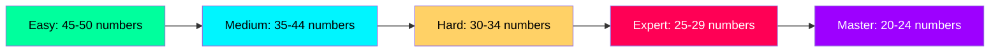

# 🎮 SUDOKU MASTER ULTIMATE 🕸️

<div align="center">


</div>

---

## 📋 Table of Contents

- [🌟 Overview](#-overview)
- [✨ Key Features](#-key-features)
- [🎯 Difficulty Levels](#-difficulty-levels)
- [💻 Installation](#-installation)
- [🎮 How to Play](#-how-to-play)
- [⌨️ Keyboard Shortcuts](#️-keyboard-shortcuts)
- [🕹️ Game Controls](#️-game-controls)
- [📊 Game Statistics](#-game-statistics)
- [🧩 Puzzle Generation](#-puzzle-generation)
- [🏆 Scoring System](#-scoring-system)
- [🔮 Future Enhancements](#-future-enhancements)

---

## 🌟 Overview

<div align="center">
  <table>
    <tr>
      <td align="center">
        <br/>
        <b>Intelligent</b>
      </td>
      <td align="center">
        <br/>
        <b>Dynamic</b>
      </td>
      <td align="center">
        <br/>
        <b>Cyberpunk</b>
      </td>
      <td align="center">
        <br/>
        <b>Timed</b>
      </td>
    </tr>
  </table>
</div>

### What is Sudoku Master Ultimate?

**Sudoku Master Ultimate** is a feature-rich, visually stunning Sudoku game built with Python and Tkinter. It combines **classic Sudoku gameplay** with a **cyberpunk aesthetic**, offering multiple difficulty levels, intelligent puzzle generation, and a comprehensive scoring system.

> *"Where classic puzzles meet futuristic design"*

### 🎯 Core Highlights

| Feature | Description |
|:-------:|:-----------|
| ✅ **5 Difficulty Levels** | Easy → Medium → Hard → Expert → Master |
| ✅ **Intelligent Puzzle Generation** | Unique solutions guaranteed |
| ✅ **Cyberpunk UI** | Neon colors, glow effects, dark theme |
| ✅ **Adaptive Interface** | Responsive design |
| ✅ **Hint System** | Get help when stuck |
| ✅ **Score Tracking** | Competitive scoring with penalties |
| ✅ **Timer System** | Track your solving speed |
| ✅ **Statistics** | Player progress tracking |
| ✅ **Keyboard Shortcuts** | Pro-level controls |

---

## ✨ Key Features

<div align="center">
  
### 🎮 **Gameplay Features**
| | | |
|:---:|:---:|:---:|
| 🧩 **5 Difficulty Levels** | ⏱️ **Real-time Timer** | 💡 **Smart Hint System** |
| 🔍 **Cell Validation** | 📊 **Completion Tracking** | 🏆 **Score System** |
| 🎯 **Mistake Counter** | 🔄 **New Game Generator** | 🤖 **Auto-Solve Mode** |

### 🎨 **UI/UX Features**
| | | |
|:---:|:---:|:---:|
| 🌃 **Cyberpunk Theme** | 🔲 **Adaptive Grid** | 🎯 **Cell Highlighting** |
| ⌨️ **Keyboard Controls** | 📱 **Responsive Design** | 🎨 **Neon Color Scheme** |
| 🔢 **Number Pad** | 📊 **Statistics Panel** | ⚡ **Glow Effects** |

</div>

---

## 🎯 Difficulty Levels

<div align="center">
  
| Level | Given Numbers | Color | Description |
|:-----:|:-------------:|:-----:|:-----------|
| **🚀 EASY** | 45-50 | `#00ff9d` | Perfect for beginners |
| **⚡ MEDIUM** | 35-44 | `#00f5ff` | Balanced challenge |
| **🔥 HARD** | 30-34 | `#ffd166` | For experienced players |
| **💀 EXPERT** | 25-29 | `#ff0055` | Serious challenge |
| **👑 MASTER** | 20-24 | `#9d00ff` | Ultimate test |

</div>

### 📊 Difficulty Comparison



### UI Elements

```
┌─────────────────────────────────────────────────────┐
│                 SUDOKU MASTER ULTIMATE  🕸️          │
├─────────────────────────────────────────────────────┤
│                       ┌───────────────────┐         │
│  ┌───┬───┬───┐       │   CONTROL PANEL   │         │
│  │ 5 │ 3 │ 4 │       ├───────────────────┤         │
│  ├───┼───┼───┤       │ 💡 GET HINT       │         │
│  │ 6 │ 7 │ 2 │       │ ✓ CHECK CELL      │         │
│  ├───┼───┼───┤       │ 🔍 VALIDATE ALL   │         │
│  │ 1 │ 9 │ 8 │       │ 🔄 NEW GAME       │         │
│  └───┴───┴───┘       │ 🤖 AUTO SOLVE     │         │
│                      │ 📊 STATISTICS     │         │
│  ┌───┬───┬───┐       ├───────────────────┤         │
│  │ 4 │ 2 │ 6 │       │   ┌───┬───┬───┐   │         │
│  ├───┼───┼───┤       │   │ 1 │ 2 │ 3 │   │         │
│  │ 7 │ 8 │ 9 │       │   ├───┼───┼───┤   │         │
│  ├───┼───┼───┤       │   │ 4 │ 5 │ 6 │   │         │
│  │ 3 │ 5 │ 1 │       │   ├───┼───┼───┤   │         │
│  └───┴───┴───┘       │   │ 7 │ 8 │ 9 │   │         │
│                      │   └───┴───┴───┘   │         │
│                      │    ┌─────────┐    │         │
│                      │    │  CLEAR  │    │         │
│                      │    └─────────┘    │         │
│                      └───────────────────┘         │
│                                                    │
│              ⏱️ 05:23    🏆 850    ⚡ 2/5         │
├─────────────────────────────────────────────────────┤
│  ESC: Menu • CTRL+N: New • CTRL+H: Hint • 1-9: Input│
└─────────────────────────────────────────────────────┘
```

---

## 💻 Installation

### Prerequisites

- Python 3.8 or higher
- Tkinter (usually comes with Python)

### 📥 Step-by-Step Installation

```bash
# 1. Clone the repository
git clone https://github.com/W01-vian/Sudoku-Master-Ultimate.git

# 2. Navigate to project directory
cd Sudoku-Master-Ultimate

# 3. Run the game
python sudoku_master_ultimate.py
```

### 📦 Dependencies

All dependencies are built into Python's standard library:

```python
import tkinter          # GUI framework
import random          # Random number generation
import time            # Timer functionality
import json            # Player data storage
import os              # File operations
```

---

## 🎮 How to Play

### 📝 Basic Rules

<details>
<summary><b>Click to expand Sudoku rules</b></summary>
<br>

1. **Fill the 9×9 grid** with digits from 1 to 9
2. **Each row** must contain all digits 1-9 without repetition
3. **Each column** must contain all digits 1-9 without repetition
4. **Each 3×3 box** must contain all digits 1-9 without repetition
5. **Fixed numbers** (given at start) cannot be changed

</details>

### 🎯 Game Objective

Complete the puzzle with:
- ✅ **No mistakes** (or as few as possible)
- ⏱️ **Fastest time possible**
- 🏆 **Highest score possible**

### 🖱️ Controls Guide

| Action | Mouse | Keyboard |
|:------:|:-----:|:--------:|
| **Select Cell** | Click on cell | Arrow keys |
| **Input Number** | Click number pad | 1-9 keys |
| **Clear Cell** | Click "CLEAR" button | Delete/Backspace |
| **Get Hint** | Click "GET HINT" button | Ctrl+H |
| **Check Cell** | Click "CHECK SELECTED CELL" | - |
| **Validate All** | Click "VALIDATE ALL CELLS" | - |
| **New Game** | Click "NEW GAME" | Ctrl+N |
| **Auto Solve** | Click "AUTO SOLVE" | Ctrl+S |
| **Main Menu** | Click "MAIN MENU" | Esc |

---

## ⌨️ Keyboard Shortcuts

<div align="center">
  
| Shortcut | Action |
|:--------:|:------:|
| `Esc` | Return to Main Menu |
| `Ctrl + N` | Start New Game |
| `Ctrl + H` | Get Hint |
| `Ctrl + S` | Auto Solve Puzzle |
| `1` - `9` | Input Number in Selected Cell |
| `Delete` / `Backspace` | Clear Selected Cell |

</div>

---

## 🕹️ Game Controls

### Control Panel Buttons

<div align="center">
  
| Button | Function |
|:------:|:--------|
| **💡 GET HINT (Ctrl+H)** | Reveals a correct number in an empty cell |
| **✓ CHECK SELECTED CELL** | Validates the currently selected cell |
| **🔍 VALIDATE ALL CELLS** | Checks all filled cells for correctness |
| **🔄 NEW GAME (Ctrl+N)** | Generates a new puzzle with current difficulty |
| **🤖 AUTO SOLVE (Ctrl+S)** | Automatically completes the entire puzzle |
| **📊 SHOW STATISTICS** | Displays current game statistics |

</div>

### Number Pad

```
┌─────────┐
│ 1  2  3 │
│ 4  5  6 │
│ 7  8  9 │
│  CLEAR  │
└─────────┘
```

---

## 📊 Game Statistics

### Real-Time Display

| Statistic | Description | Example |
|:---------:|:-----------:|:-------:|
| **⏱️ Timer** | Time elapsed | `05:23` |
| **🏆 Score** | Current points | `850` |
| **⚡ Mistakes** | Errors made / Limit | `2/5` |
| **📊 Completion** | Progress percentage | `78%` |

### Player Statistics (Persistent)

```json
{
    "best_score": 1250,
    "best_time": 347,
    "games_played": 42,
    "total_wins": 38,
    "total_hints": 15
}
```

---

## 🧩 Puzzle Generation

### Generation Algorithm

```python
def generate_fresh_puzzle(self):
    """Generate a completely new random puzzle"""
    # 1. Create complete solved board
    self.generate_complete_board()
    
    # 2. Copy to solution
    self.solution = [row[:] for row in self.board]
    
    # 3. Remove numbers based on difficulty
    cells_to_keep = {
        'easy': random.randint(45, 50),
        'medium': random.randint(35, 44),
        'hard': random.randint(30, 34),
        'expert': random.randint(25, 29),
        'master': random.randint(20, 24)
    }[self.current_difficulty]
    
    cells_to_remove = 81 - cells_to_keep
    self.remove_cells(cells_to_remove)
```

### Solution Uniqueness

The system ensures **every puzzle has a unique solution**:

```python
def has_unique_solution(self):
    """Check if puzzle has unique solution"""
    board_copy = [row[:] for row in self.board]
    return self.count_solutions(board_copy) == 1
```

---

## 🏆 Scoring System

### Points Calculation

| Action | Points |
|:------:|:------:|
| **Start** | 1000 base points |
| **Correct Number** | +10 |
| **Wrong Number** | -20 |
| **Hint Used** | -50 |
| **Mistake Penalty** | -30 per mistake (final) |
| **Time Penalty** | -5 per 30 seconds over 5 minutes |

### Final Score Formula

```
Final Score = max(0, 
    Base(1000) 
    + (Correct_Moves × 10) 
    - (Wrong_Moves × 20) 
    - (Hints × 50) 
    - (Mistakes × 30) 
    - (max(0, (Time - 300) ÷ 30) × 5)
)
```

---

## 🔮 Future Enhancements

### 📅 Planned Features

- [ ] **Multiplayer Mode** - Compete with friends online
- [ ] **Daily Challenges** - New puzzle every day
- [ ] **Achievement System** - Unlockable badges
- [ ] **Sound Effects** - Immersive audio feedback
- [ ] **Dark/Light Theme** - Toggle between themes
- [ ] **Export/Import** - Share puzzles with others
- [ ] **Undo/Redo** - Multiple move history
- [ ] **Pencil Marks** - Note possible numbers

### 🚀 Advanced Features

- [ ] **Machine Learning** - Adaptive difficulty based on player skill
- [ ] **Cloud Sync** - Cross-device progress tracking
- [ ] **Tournament Mode** - Compete in timed events
- [ ] **Custom Puzzles** - Create and share your own

---

<div align="center">
  
  ## 🌟 Thank You for Playing! 🌟
  
  
  
  <p><i>"Every puzzle has a solution — you just need to find it"</i></p>
  
  [🔝 Back to Top](#-sudoku-master-ultimate-️)
  
  ---
  
  <sub>Associated with National University of Technology (NUTECH)</sub>
  
</div>
